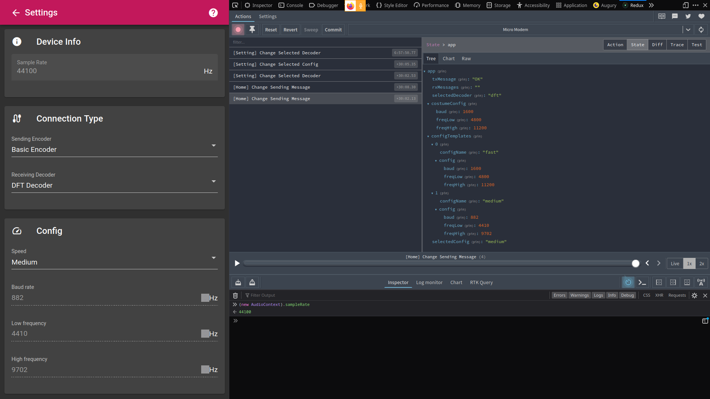

# NgModem

This project is a library for communicating with microcontrollers via the headphone jack.

## Demo

You can see the demo at [https://micromodem.ml](https://micromodem.ml).

## License

The project is licensed under the GPLv3.
